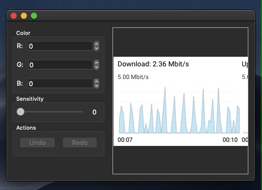

# Qt-based Magic Wand Tool (Image Editing Program)

> Open source implementation of one of the most popular image editing tools from Adobe Photoshop raster graphics editor 

Based on a recursive function that runs through adjacent dots of similar color. Processed points are excluded. The code responsible for rendering the user interface is moved to a separate class. If you want to repeat the solution, look at the implementation of the `Worker` class